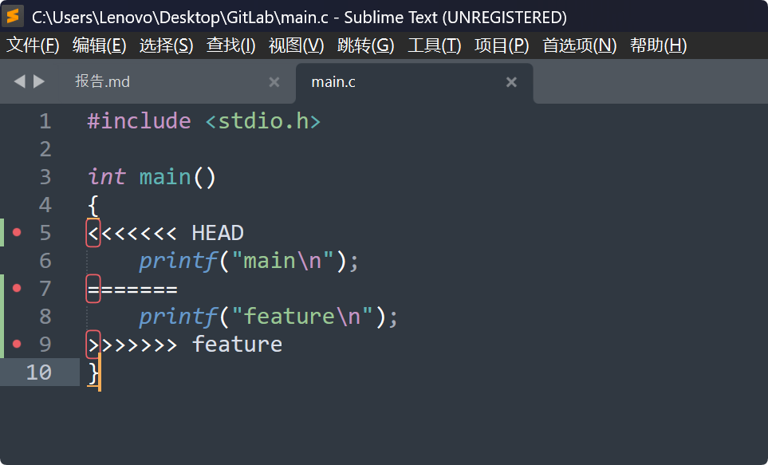
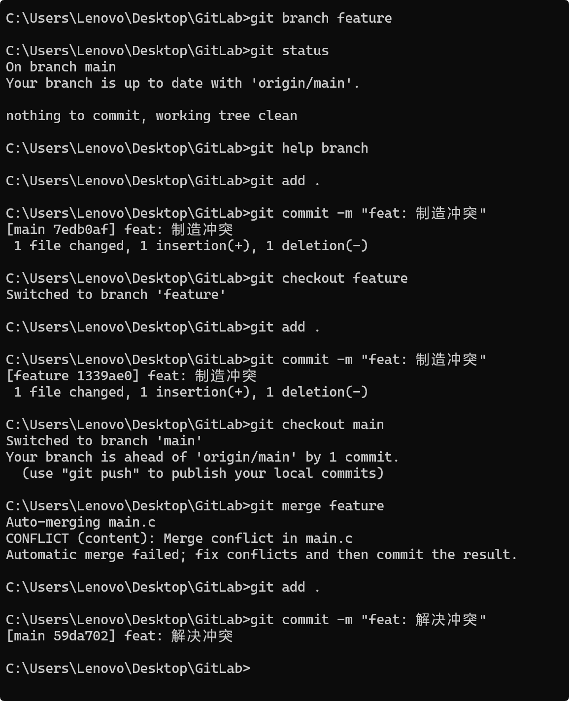
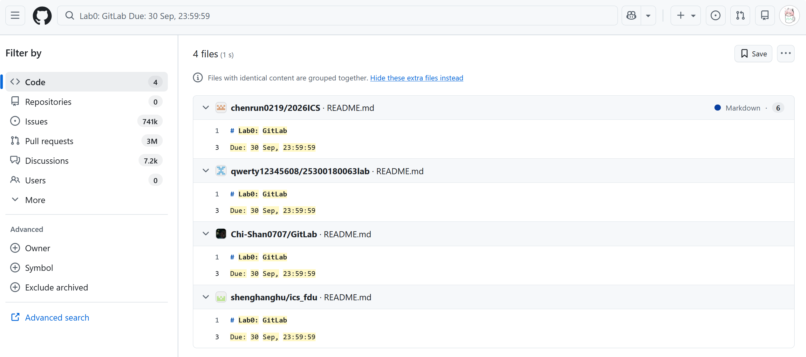

## 一

- 有过。使用 git 或者其他类似 git 的系统。也有过抱着 qq 传文件，但是不太方便。
- 	1. 可能会出现对修改不满意要回退的情况。分成这两个阶段可以更方便。
	2. 解决复杂问题的时候可能要做很多修改，每次修改都 commit 不方便。可以暂存所有修改一并 commit。
- 

## 二

`a sentence you want.`

## 三

都看了。大概是一些约定俗成的习惯问题。如果所有人都有相同的习惯，用统一的格式，那么协作会变得更方便。

## 四

现在应该制造一个冲突。

## 五

个人习惯使用 Sublime。

在 Windows 进行 git 操作不会有什么障碍啊，不知道为什么会要求以后的实验在 Linux 上完成？

看到了 Workflow file。修改它能不能获得更多分数？

这样是不是可以随便参考别人的作业。